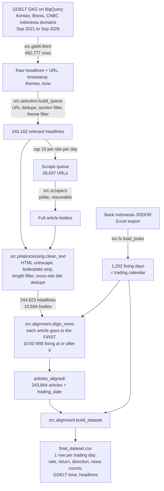

# Global Geopolitical Event Prediction: Impact on USD/IDR

**Task 1: Data Acquisition & Strategic Preprocessing.** This is the NLP course project testing the hypothesis:
*global geopolitical news significantly influences and helps predict fluctuations in the USD exchange rate.*

This repo builds a clean, aligned 5-year dataset (1 Sep 2021 to 1 Sep 2026) from two streams:

| Stream | Source | Final size |
|---|---|---|
| Geopolitical / macro news | GDELT GKG (discovery + metadata), with full text scraped from Bisnis.com and Kontan.co.id | 243,844 articles |
| USD/IDR exchange rate | **Bank Indonesia JISDOR** reference rate | 1,202 trading days |

---

## Repository layout

```
├── config.yaml                  # every tunable choice: dates, sources, sections, themes, cutoff
├── requirements.txt
├── src/
│   ├── common/                  # config loader, GDELT helpers (URL normalisation, UTC -> WIB)
│   ├── gdelt/                   # 1. BigQuery pull of GDELT GKG rows (+ SQL queries)
│   ├── selection/               # 2. section + theme filter, capped scrape queue
│   ├── scrapers/                # 3. per-site full-text scrapers (polite, resumable)
│   ├── preprocessing/           # 4. text cleaning + deduplication
│   ├── fx/                      # 5. Bank Indonesia JISDOR loader
│   ├── alignment/               # 6. news -> trading-day alignment, 7. final dataset
│   └── make_raw_samples.py      # writes data/raw_sample/
├── data/
│   ├── raw_sample/              # small samples of every raw source (GDELT rows, scraped articles, JISDOR xlsx)
│   └── processed/               # final cleaned + aligned dataset (see "Output data" below)
└── notebooks/
    └── 01_task1_eda.ipynb       # evidence for the filtering/alignment choices
```

The full raw pulls (`data/raw/`, ~280 MB) and intermediate tables (`data/interim/`) are not committed. Every script regenerates them.

## Pipeline



### How to run

Run everything from the repository root:

```bash
python -m venv .venv && source .venv/bin/activate
pip install -r requirements.txt
gcloud auth application-default login          # BigQuery auth (only for step 1)

python -m src.gdelt.fetch --query coverage      # sanity check: which domains GDELT indexes
python -m src.gdelt.fetch --query id --year 2021  # repeat for 2021..2026
python -m src.selection.build_queue
python -m src.scrapers.run_all                  # resumable; skips already-saved URLs
python -m src.preprocessing.clean_text
# download JISDOR Excel from bi.go.id -> data/raw/jisdor/jisdor_raw.xlsx (see below)
python -m src.fx.load_jisdor
python -m src.alignment.align_news
python -m src.alignment.build_dataset
python -m src.make_raw_samples
```

---

## 1. News source and why

**GDELT** (one of the allowed sources) is the discovery index and metadata layer. Its translingual GKG feed gives every article's URL, original-language headline, capture timestamp, GDELT topic themes, and tone across the whole 5-year window, without fetching a page. Full text is then scraped from the publishers for a capped subset.

- **Why not scrape whole sites:** a domain-wide crawl (via the Wayback Machine CDX API) was tried first. It hit 504 timeouts, needed about 1M requests, and Kontan URLs carry no date. GDELT solves discovery and dating in one query.
- **Why Indonesian outlets (Bisnis.com, Kontan.co.id):** the target is USD/IDR, so we want the news the Indonesian market actually reads, including its coverage of global geopolitical events (wars, sanctions, Fed policy, trade disputes).
- **CNBC Indonesia** was planned but has **zero** rows in GDELT's translingual feed, so it was dropped (a data-availability fact, not a bug). **Kontan** is only indexed from March 2023.
- The global English-outlet pull (Reuters, AP, BBC, …) is implemented in `src/gdelt/queries/global_headlines.sql` but was **not run**: the BigQuery free-tier quota was used up by the Indonesian pulls.

## 2. Scraping technique

- Discovery with a **BigQuery SQL query** on `gdelt-bq.gdeltv2.gkg_partitioned`, filtered by domain and date partition to keep the scanned bytes low.
- Full text with **per-site parsers** (`src/scrapers/`) on `requests` + `BeautifulSoup`:
  - a random 1–3 s delay between requests, retries with backoff, and an identifying User-Agent
  - JSONL checkpointing, so a killed run resumes where it stopped
  - a failed-URL log (`_failed.jsonl`)
- A cap of **15 articles per site per day** (picked deterministically by URL hash) keeps scraping to about 40k URLs instead of 245k. Headline coverage stays complete. Bodies were scraped for the 2024 pilot year (10,594 articles).

## 3. Filtering strategy

| Stage | Rows kept |
|---|---|
| Raw GDELT pull | 492,777 |
| URL dedupe (strip query string, `/amp/`, trailing slash) | 492,750 |
| **Section filter**: keep national, international, economy, market and finance channels; drop lifestyle, sport, regional editions, press releases, personal finance, etc. | 252,302 |
| **Theme filter**: keep articles tagged with GDELT themes `ECON_`, `EPU_`, `TRADE`, `ARMEDCONFLICT`, `MILITARY`, `SANCTIONS`, `CRISISLEX`, `TAX_FNCACT` | 245,162 |
| Empty-title drop + cross-site title dedupe | 244,823 |
| Aligned to a trading day in range | 243,844 |

The section filter does most of the work. The theme filter is a light second pass (about 3% dropped). Full counts are in `data/processed/filter_report.json`.

## 4. Cleaning and preprocessing

What we **kept**:

- the headline, the article body, GDELT themes (unique names only), GDELT document tone, source, section, URL, and the exact timestamp

What we **dropped or changed**:

- **HTML entities** are unescaped and whitespace is normalised.
- **Boilerplate lines** in bodies are removed with per-site regexes: bylines ("Reporter: … | Editor: …"), "Baca Juga" link blocks, and subscription and follow-us promos.
- **Bodies under 200 characters** are dropped. These are failed parses or paywall stubs.
- **Duplicates across sites** are removed by normalised title (keeping the earliest).
- **Theme character offsets** are stripped (`ECON_INFLATION,693;ECON_INFLATION,812` becomes `ECON_INFLATION`).

We deliberately do **not** lowercase, stem, or remove stopwords here. Those choices depend on the NLP method chosen in Task 2, so the dataset keeps the original text.

## 5. Exchange rate: Bank Indonesia JISDOR

- **Source:** Bank Indonesia's **JISDOR** (Jakarta Interbank Spot Dollar Rate), the official daily USD/IDR reference rate. Downloaded as Excel from [bi.go.id → Statistik → Informasi Kurs → JISDOR](https://www.bi.go.id/id/statistik/informasi-kurs/jisdor/default.aspx) and saved to `data/raw/jisdor/jisdor_raw.xlsx`. BI's site blocks scripted access, so this step is manual. A copy is committed in `data/raw_sample/`.
- **Trading calendar:** BI publishes JISDOR only on Indonesian business days. The JISDOR dates therefore *are* the trading calendar, and weekends, public holidays and *cuti bersama* are excluded automatically. We do **not** forward-fill fake rates onto non-trading days.
- Derived columns: `pct_change`, `log_return`, `direction` (+1 means IDR weakened, −1 means IDR strengthened, 0 means flat), and `calendar_days_since_prev` (3 on a Monday, more after holidays).

## 6. Alignment rule: news time vs. trading days

JISDOR is fixed once per business day and **published at 10:00 WIB** (`config.yaml → alignment.cutoff_time_wib`). All timestamps are converted from GDELT's UTC to **WIB (UTC+7)**, because IDR trades in Jakarta.

**Rule: each article is assigned to the first JISDOR fixing at or after its timestamp.**

| Case | Example | Assigned trading day | Share of articles |
|---|---|---|---|
| `same_day`: trading day, before the 10:00 fixing | Tue 08:30 | Tue | 17% |
| `after_cutoff`: trading day, after the fixing | Tue 14:00 | Wed (next trading day) | 64% |
| `non_trading_day`: weekend or public holiday | Sat 11:00, or Idul Fitri | next trading day (e.g. Mon) | 19% |

Why this rule:

1. **No look-ahead leakage.** An article is only ever linked to a rate fixed *after* it appeared, so it can never "explain" a rate that was already known.
2. **No news is thrown away.** Weekend and holiday news piles onto the next fixing, which is the first moment the market can react to it.
3. **Conservative timestamps.** GDELT timestamps are *capture* times in 15-minute batches, always at or slightly after real publication, so any error pushes an article later, never earlier.

The rule is verified in code: for every article, its fixing is at or after the article's timestamp, and the previous fixing is before it. Counts are in `data/processed/alignment_report.json`.

---

## Output data

`data/processed/final_dataset.csv` is the main deliverable: **one row per JISDOR trading day** (1,202 rows).

| Column | Meaning |
|---|---|
| `date` | trading day (JISDOR fixing date) |
| `jisdor_rate` | IDR per USD |
| `pct_change`, `log_return` | change vs. previous fixing |
| `direction` | +1 up (IDR weaker), −1 down (IDR stronger), 0 flat |
| `calendar_days_since_prev` | gap since previous fixing (weekends/holidays) |
| `n_articles`, `n_bisnis`, `n_kontan` | articles aligned to this day, total and per source |
| `n_with_body` | how many of them have scraped full text |
| `n_non_trading_day_articles` | how many came from a weekend/holiday before this day |
| `gdelt_tone_mean` | mean GDELT document tone of those articles |
| `titles` | all aligned headlines, oldest first, joined with `" \|\| "` |

Other files:

- `data/processed/articles_aligned/articles_<year>.parquet`: one row per article (`article_id`, `timestamp_wib`, `calendar_date_wib`, `trading_date`, `alignment_case`, `source`, `section`, `url`, `title`, `body`, `has_body`, `themes`, `gdelt_tone`). Load the whole folder with `pd.read_parquet("data/processed/articles_aligned")`.
- `data/processed/usd_idr_jisdor.csv`: the clean JISDOR series.
- `data/processed/filter_report.json` and `alignment_report.json`: stage counts.
- `data/raw_sample/`: raw GDELT rows, raw scraped articles, and the raw JISDOR export.

No sentiment or other NLP features are computed in Task 1. Feature extraction belongs to Task 2.

## Known limitations

- **News gap from Aug 2022 to Jan 2023.** GDELT's own coverage of these domains collapses to about 500 rows per month (normally about 7,000), leaving 133 trading days (late Jul 2022 to Jan 2023) with zero news. There are 11 more zero-news days in Jun–Jul 2025, for 144 in total. This comes from the source (visible in the raw pull), not from our filters.
- **Kontan** is only indexed by GDELT from March 2023. Before that, all news is from Bisnis.
- **Full-text bodies exist for 2024 only** (10,594 articles). Headlines cover all 5 years.
- **Global English outlets were not pulled** (BigQuery quota). The dataset tests the hypothesis through Indonesian financial media's coverage of global events.
